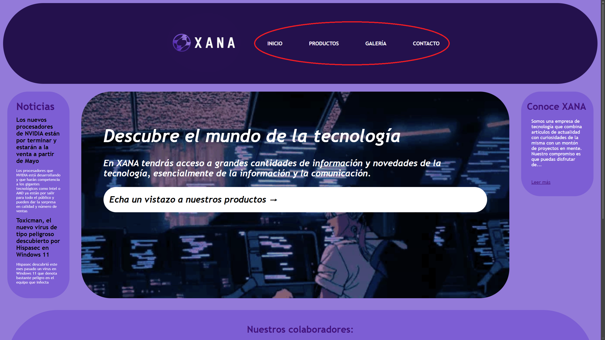
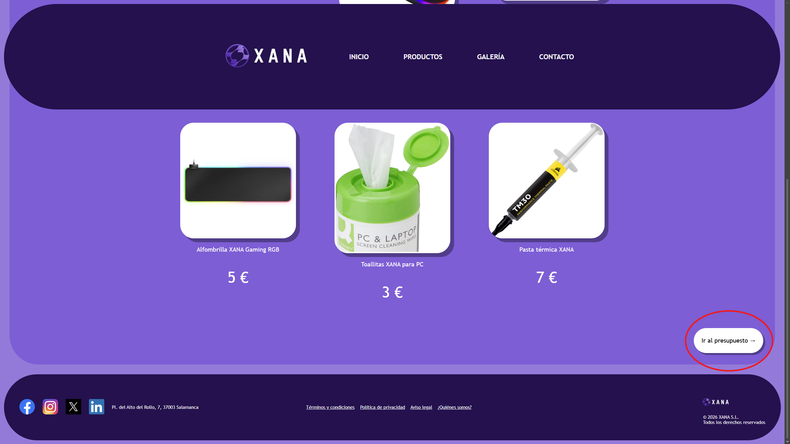
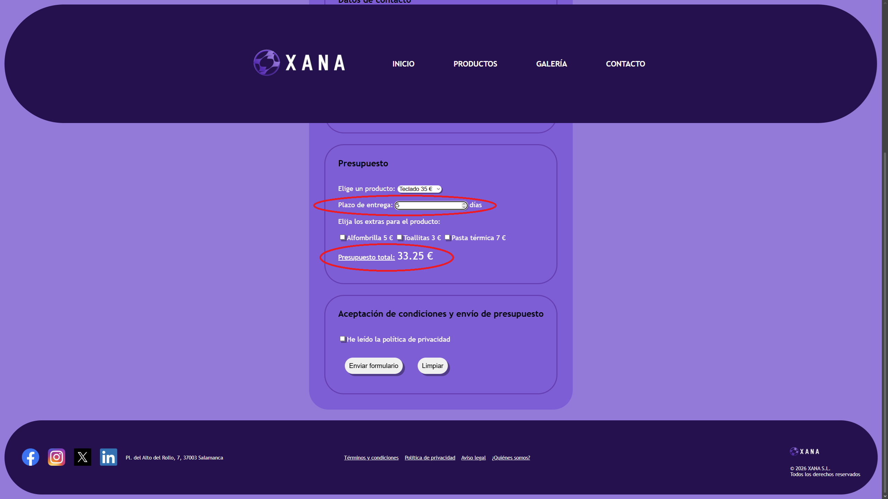

# XANA

XANA es una empresa de tecnología, sobre todo de informática, que combina artículos de actualidad con curiosidades de la misma. Aquí encontrarás información de utilidad, noticias actuales, venta de nuestros productos, una galería de imágenes, etc., y todo ello relacionado con la informática.

El tren sólo pasa una vez. Aprovecha :)

## Instrucciones de uso

Para acceder y poder disfrutar del contenido es muy sencillo. Primero que nada debes acceder a la página haciendo clic en el siguiente enlace: [https://robertoll03.github.io/Roberto\_Lluvia\_trabajoJAVASCRIPT/](https://robertoll03.github.io/Roberto_Lluvia_trabajoJAVASCRIPT/). 

Tienes varias secciones:

* Noticias
* Productos
* Galería de imágenes
* Información de nuestros colaboradores
* Apartado o sección para conocer mejor XANA
* Y un sinfín de cosas más

Para ver los contenidos de los productos y la galería tan solo tienes que pulsar en las opciones de la barra de navegación con sus respectivos nombres:  

  

Para elegir y adquirir los productos, tienes la opción de Ir al presupuesto en la parte baja de la página de dichos productos:  

  

Desde el presupuesto, tienes que rellenar los datos que te pide y después elegir el producto que quieras. También puedes seleccionar los extras. De ahí te marcará el precio total de dicho presupuesto.

Puedes obtener un descuento que se aplicará al precio total. Se realiza en base al plazo de días de entrega que introduzcas:

* Si introduces de 4 a 7 días, se te aplicará un descuento del 5%.
* Si introduces 8 días o más, el descuento será del 10%.  

## Direcciones de repositorio y hosting de GitHub

Repositorio: [https://github.com/RobertoLL03/Roberto\_Lluvia\_trabajoJAVASCRIPT](https://github.com/RobertoLL03/Roberto_Lluvia_trabajoJAVASCRIPT)

Hosting: [https://robertoll03.github.io/Roberto\_Lluvia\_trabajoJAVASCRIPT/](https://robertoll03.github.io/Roberto_Lluvia_trabajoJAVASCRIPT/)

